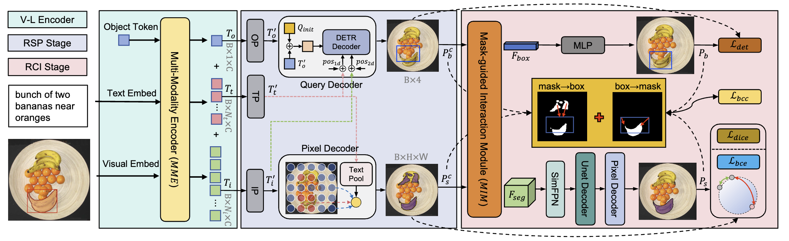

# Multi-task Visual Grounding with Coarse-to-Fine Consistency Constraints

[Ming Dai](https://dmmm1997.github.io/), Jian Li, Jiedong Zhuang, Xian Zhang, [Wankou Yang*](https://automation.seu.edu.cn/ywk/main.psp)

SouthEast University, Tencent, Zhejiang University

<a href='https://arxiv.org/pdf/2501.06710'></a>
 
[](https://paperswithcode.com/sota/referring-expression-comprehension-on-refcoco?p=multi-task-visual-grounding-with-coarse-to)
[](https://paperswithcode.com/sota/referring-expression-segmentation-on-refcoco-8?p=multi-task-visual-grounding-with-coarse-to)
[](https://paperswithcode.com/sota/referring-expression-segmentation-on-refcoco-9?p=multi-task-visual-grounding-with-coarse-to)
[](https://paperswithcode.com/sota/referring-expression-segmentation-on-refcoco-5?p=multi-task-visual-grounding-with-coarse-to)
[](https://paperswithcode.com/sota/referring-expression-segmentation-on-refcoco-3?p=multi-task-visual-grounding-with-coarse-to)
[](https://paperswithcode.com/sota/referring-expression-comprehension-on-refcoco-1?p=multi-task-visual-grounding-with-coarse-to)
[](https://paperswithcode.com/sota/referring-expression-segmentation-on-refcocog-1?p=multi-task-visual-grounding-with-coarse-to)
[](https://paperswithcode.com/sota/referring-expression-segmentation-on-refcoco-4?p=multi-task-visual-grounding-with-coarse-to)
[](https://paperswithcode.com/sota/referring-expression-comprehension-on-1?p=multi-task-visual-grounding-with-coarse-to)
[](https://paperswithcode.com/sota/referring-expression-comprehension-on?p=multi-task-visual-grounding-with-coarse-to)
[](https://paperswithcode.com/sota/referring-expression-segmentation-on-refcocog?p=multi-task-visual-grounding-with-coarse-to)
[](https://paperswithcode.com/sota/referring-expression-segmentation-on-refcoco?p=multi-task-visual-grounding-with-coarse-to)


## Updates

- **2025.05.28: The code and model are released.**
- **2024.10.10: Our work has been accepted by AAAI 2025.**


## Abstract

Multi-task visual grounding involves the simultaneous execution of localization and segmentation in images based on textual expressions. The majority of advanced methods predominantly focus on transformer-based multimodal fusion, aiming to extract robust multimodal representations. However, ambiguity between referring expression comprehension (REC) and referring image segmentation (RIS) is errorprone, leading to inconsistencies between multi-task predictions. Besides, insufficient multimodal understanding directly contributes to biased target perception. To overcome these challenges, we propose a Coarse-to-fine Consistency Constraints Visual Grounding architecture (C3VG), which integrates implicit and explicit modeling approaches within a two-stage framework. Initially, query and pixel decoders are employed to generate preliminary detection and segmentation outputs, a process referred to as the Rough Semantic Perception (RSP) stage. These coarse predictions are subsequently refined through the proposed Mask-guided Interaction Module (MIM) and a novel explicit bidirectional consistency constraint loss to ensure consistent representations across tasks, which we term the Refined Consistency Interaction (RCI) stage. Furthermore, to address the challenge of insufficient multimodal understanding, we leverage pre-trained models based on visual-linguistic fusion representations. Empirical evaluations on the RefCOCO, RefCOCO+, and RefCOCOg datasets demonstrate the efficacy and soundness of C3VG, which significantly outperforms state-of-the-art REC and RIS methods by a substantial margin.


## FrameWork

<!--    -->
  
<!--  
 
  -->


## Installation

CUDA=11.8
torch=2.0.0
torchvision=0.15.0

### Prerequisites

```bash
pip install -r requirements.txt
```
<!-- Our code depends on parts of [detrex](https://detrex.readthedocs.io/en/latest/tutorials/Installation.html) and [detectron2](https://github.com/facebookresearch/detectron2), so you need to install and compile them.
```
python -m pip install 'git+https://github.com/facebookresearch/detectron2.git'
git clone https://github.com/IDEA-Research/detrex.git
cd detrex
git submodule init
git submodule update
pip install -e .
```
Then install C3VG package in editable mode:
```
pip install -e .
``` -->

### Data Preparation

Prepare the mscoco dataset, Then download the mixed annotations [here](https://seunic-my.sharepoint.cn/:u:/g/personal/230238525_seu_edu_cn/EaP-0gzxQshOsku-0Q2bTZYBTxg-F3kWl7-nGQtEAOOmxg?e=a94SbX)

The data structure should look like the following:
```
| -- data
| -- annotations
    | -- mixed-seg
        | -- instances_nogoogle.json
| -- images
    | -- mscoco
        | -- train2014
```

### Pre-trained Weights

`C3VG` utilizes the [BEiT-3](https://github.com/microsoft/unilm/blob/master/beit3/README.md) model as both the backbone and the multi-modality fusion module. The pre-trained weights can be downloaded from [this link](https://github.com/microsoft/unilm/blob/master/beit3/README.md#download-checkpoints). Additionally, you will need to download the [tokenizer](https://github.com/microsoft/unilm/blob/master/beit3/README.md#text-tokenizer) for BEiT-3.

First, create a directory for the pre-trained weights:

```
mkdir pretrain_weights
```
Place the BEiT checkpoints and tokenizer within this directory.

The final directory structure of C3VG should resemble the following:
```
C3VG
├── configs
├── data
├── docs
├── pretrain_weights
├── c3vg
└── tools
```

## Training

We train C3VG on a 2 RTX4090 GPU with 24 GB memory. The following script performs the training:

```bash
bash tools/dist_train.sh configs/C3VG-Mix.py 2
```

## Evaluation

You can use the following instruction for testing all type of models.

```bash
bash tools/dist_test.sh configs/C3VG-Mix.py 2 --load-from [PATH_TO_CHECKPOINT_FILE]
```

## Models & Results

Note: Due to the unavailability of the original paper’s pretrained weights, we retrained an additional version. The results may exhibit slight variations compared to those reported in the original paper. For reference, we also provide the paper's [training logs](https://seunic-my.sharepoint.cn/:u:/g/personal/230238525_seu_edu_cn/EevQmBrMImBDnzMPbDVo7foBRdFVmYNMRJwI0xYvtj9MtA?e=y4gz9j).

### Models

The trained model can be download in this [link](https://seunic-my.sharepoint.cn/:u:/g/personal/230238525_seu_edu_cn/EevQmBrMImBDnzMPbDVo7foBRdFVmYNMRJwI0xYvtj9MtA?e=y4gz9j).

If you want to reproduce the result, download it and then run the following scripts:
```bash
bash tools/dist_test.sh [PATH_TO_CONFIG] [GPU_NUMBER] --load-from [PATH_TO_CHECKPOINT_FILE]
```

### Results

| Split                  | DetAcc (paper) | MaskAcc | mIoU (paper)  | oIoU (paper)  |
|------------------------|      --------  |---------|   -------     |    -------    |
| val_refcoco_unc        | 92.40 (92.51)  | 92.23   | 81.42 (81.37) | 80.95 (80.89) |
| testA_refcoco_unc      | 94.81 (94.60)  | 94.73   | 82.98 (82.93) | 82.91 (83.18) |
| testB_refcoco_unc      | 89.63 (88.71)  | 89.10   | 79.86 (79.12) | 79.03 (77.86) |
| val_refcocoplus_unc    | 87.21 (87.44)  | 87.05   | 77.00 (77.05) | 74.32 (74.68) |
| testA_refcocoplus_unc  | 90.59 (90.69)  | 90.59   | 79.53 (79.61) | 77.84 (77.96) |
| testB_refcocoplus_unc  | 81.61 (81.42)  | 81.39   | 72.90 (72.40) | 69.29 (68.95) |
| val_refcocog_umd       | 87.85 (87.68)  | 85.62   | 76.20 (76.34) | 74.85 (74.43) |
| test_refcocog_umd      | 88.19 (88.31)  | 87.16   | 77.05 (77.10) | 76.43 (76.39) |


### Acknowledge
This repository partially builds upon the codebases of [SimVG](https://github.com/Dmmm1997/SimVG/) and [BEiT-3](https://github.com/microsoft/unilm/tree/master/beit3).


## Citation

```
@article{dai2025multi,
  title={Multi-task Visual Grounding with Coarse-to-Fine Consistency Constraints},
  author={Dai, Ming and Li, Jian and Zhuang, Jiedong and Zhang, Xian and Yang, Wankou},
  journal={arXiv preprint arXiv:2501.06710},
  year={2025}
}
```
